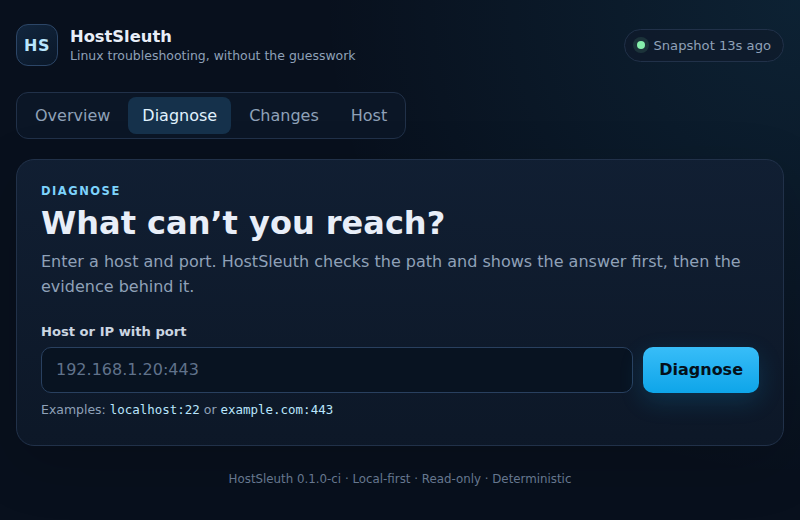

# HostSleuth

**A small, local-first Linux flight recorder for two questions: what changed, and why can I not reach this host/service/port?**

HostSleuth records meaningful Linux state changes and performs deterministic, evidence-backed `host:port` diagnosis. It does not require a cloud account, external database, API key, or AI model.

## Quick start — recommended native install

Native Linux is the recommended deployment because it gives HostSleuth the fullest view of the machine.

Requirements: Linux with systemd. Go is **not** required when installing a release.

```bash
git clone https://github.com/xXDasGoGXx/HostSleuth.git
cd HostSleuth
sudo ./scripts/install.sh
```

Check that it is running:

```bash
systemctl status hostsleuth --no-pager
hostsleuth version
```

HostSleuth binds its Web UI to loopback by default for safety.

If you are using HostSleuth on the same machine, open:

```text
http://127.0.0.1:8787
```

If HostSleuth is running on a remote server, use an SSH tunnel from your computer:

```bash
ssh -L 8787:127.0.0.1:8787 user@your-server
```

Then open `http://127.0.0.1:8787` locally.

A new install starts by taking a baseline snapshot. An empty change timeline is normal until HostSleuth observes a meaningful change.

## Docker — convenient, reduced host visibility

The supported public image is:

```text
mjmalleo/hostsleuth
```

`latest` represents the newest stable release. Stable releases also receive an explicit numeric tag such as `0.6.0`.

### Docker Compose

The repository includes one supported `compose.yaml` for Linux Docker hosts:

```bash
git clone https://github.com/xXDasGoGXx/HostSleuth.git
cd HostSleuth
docker compose pull
docker compose up -d
```

To pin the current stable release instead of `latest`:

```bash
HOSTSLEUTH_IMAGE=mjmalleo/hostsleuth:0.6.0 docker compose up -d
```

### Docker run

The equivalent direct `docker run` deployment is:

```bash
docker run -d \
  --name hostsleuth \
  --restart unless-stopped \
  --network host \
  --pid host \
  --uts host \
  --read-only \
  --cap-drop ALL \
  --security-opt no-new-privileges:true \
  --tmpfs /tmp:rw,noexec,nosuid,size=16m \
  -v hostsleuth-data:/var/lib/hostsleuth \
  -v /etc/os-release:/host/etc/os-release:ro \
  -v /var/run/docker.sock:/var/run/docker.sock:ro \
  mjmalleo/hostsleuth:latest
```

The Web UI remains on `127.0.0.1:8787`, so use the same local browser or SSH-tunnel workflow described above. Because HostSleuth uses host networking, Docker does not publish a separate port mapping.

### Optional direct LAN access

Loopback-only remains the safe default. If you deliberately want HostSleuth reachable directly from a trusted LAN, override the Compose service command and bind it to one specific host LAN address rather than every interface:

```yaml
services:
  hostsleuth:
    command:
      - serve
      - --state-dir
      - /var/lib/hostsleuth
      - --listen
      - 192.168.1.50:8787
      - --interval
      - 60s
```

Replace `192.168.1.50` with the Linux host address you want HostSleuth to use, redeploy the Compose project, and open `http://192.168.1.50:8787` from a routed device that is allowed to reach that address.

HostSleuth does not currently provide Web UI authentication. Direct LAN access can expose hostnames, IP addresses, listeners, container metadata, and other infrastructure details to any device that can reach the bound address. Prefer a specific trusted LAN address over `0.0.0.0`, and keep routing/firewall policy appropriately restricted. SSH tunneling remains the recommended remote-access default.

The Docker deployment intentionally does **not** use `privileged: true`. It drops all Linux capabilities, uses a read-only container filesystem, and shares only the host namespaces/mounts needed for the evidence it can collect honestly.

Docker mode can observe host networking/listeners and Docker container metadata, but container isolation prevents safe, reliable access to everything the native service can see. In Docker mode:

- systemd service/journal evidence is reported as unavailable;
- M7 Service Story is therefore unavailable as a native systemd story rather than being simulated from incomplete Docker evidence;
- host filesystem inventory is reported as unavailable;
- host `apt` / `dpkg` package-history evidence is unavailable in the default Docker deployment because host package logs are not mounted;
- host configuration-fingerprint evidence is unavailable in the default Docker deployment because those host configuration files are not mounted;
- native Certbot lineage/renewal evidence is unavailable in the default Docker deployment because host `/etc/letsencrypt` and systemd state are not mounted;
- firewall evidence may be unavailable without elevated network-administration privileges;
- remote/served TLS certificate evidence remains available because it comes from the diagnosed endpoint itself;
- Incident Lens and Reboot Story can still show whichever retained event categories the Docker deployment actually records, without pretending unavailable native evidence exists;
- M11 native systemd Safe Actions are unavailable in Docker mode;
- native installation remains the recommended choice when full host visibility or optional Safe Actions matter.

The Docker deployment mounts `/var/run/docker.sock` so HostSleuth can inventory Docker containers. Access to the Docker daemon socket is inherently powerful even when its bind path is mounted read-only. HostSleuth uses it only for read-only inventory commands, but only run this deployment on a host where you trust the HostSleuth container and image source.

### Build the container from source

Developers can still build the image locally rather than consuming the public image:

```bash
git clone https://github.com/xXDasGoGXx/HostSleuth.git
cd HostSleuth
docker build -t hostsleuth:dev .
HOSTSLEUTH_IMAGE=hostsleuth:dev docker compose up -d
```

## What it does

### Remember meaningful changes

HostSleuth periodically captures useful local state including:

- host identity, OS, kernel, and memory;
- Linux kernel boot ID and exact boot start when available;
- filesystems and capacity in native mode;
- interfaces and routes;
- listening sockets;
- systemd services in native mode;
- Docker containers, published ports, state, and network names when Docker is readable;
- bounded Debian/Ubuntu package install, update, and removal history from local `dpkg` logs, with `apt` history as a fallback, in native mode;
- SHA-256 fingerprints for a small explicit set of high-value configuration files in native mode, storing path/state/fingerprint/size rather than file contents.

It compares snapshots and records meaningful service/container/listener/package/configuration changes in one local event timeline. A reboot event is recorded only when a previously known kernel boot ID changes to another known boot ID. Known noisy changes such as Docker uptime progression are suppressed. Package history, configuration fingerprints, and boot identity are baselined across schema upgrades so pre-existing or newly introduced evidence is not falsely replayed as a change.

Configuration fingerprinting currently covers `/etc/hosts`, `/etc/fstab`, `/etc/ssh/sshd_config`, `/etc/docker/daemon.json`, and `/etc/nftables.conf`. Missing or unreadable files remain truthful and quiet, and HostSleuth does not recursively crawl `/etc`.

### Diagnose `host:port`

Enter a target such as `192.168.1.20:443` or `example.com:443`. HostSleuth can combine:

- DNS resolution;
- kernel route evidence;
- TCP connectivity;
- target-aware local TCP listener evidence;
- Docker port publication, bind address, and network context;
- bounded nftables candidate evidence when available;
- bounded failed-systemd candidate evidence in native mode;
- TLS handshake result, negotiated protocol, and cipher suite when the endpoint speaks TLS;
- served certificate subject, SANs, issuer, serial, validity window, remaining lifetime, and SHA-256 fingerprint;
- certificate hostname match/mismatch and bounded trust-chain verification;
- on native Linux for local TLS endpoints, bounded read-only Certbot lineage, renewal, timer/service, and local-vs-served certificate evidence when available.

The Web UI presents the answer first and keeps the underlying evidence available for inspection. Successful TCP remains definitive transport evidence; TLS validation is reported separately so a reachable endpoint can still be explained as having a handshake, expiry, hostname, trust, or stale-served-certificate problem. Stronger local bind/listener evidence outranks weaker candidates, and unavailable optional evidence stays `unknown` rather than becoming a false failure.

HostSleuth only calls a local certificate "newer/different than the one this endpoint is serving" when a unique readable Certbot lineage matches the requested host and deterministic validity/fingerprint evidence supports that statement. A fingerprint difference alone is not treated as proof of staleness.

### Expected Endpoint Contracts — stable v0.6.0

M12 adds an on-demand Expected-vs-Observed check for an endpoint. A contract always requires TCP reachability and can optionally require an exact DNS address set, TLS behavior, an active native systemd service, and/or a running container.

Example:

```bash
hostsleuth contract \
  --expect-ip 192.0.2.10 \
  --tls verified \
  --container web \
  example.com:443
```

The result reports each expectation as `pass`, `fail`, or `unknown`, identifies the first proven mismatch, and includes the existing full Diagnosis evidence for deeper inspection. Exact DNS expectations are order-independent exact sets; omit them for endpoints whose addresses are intentionally dynamic.

The Web UI exposes the same workflow under **Expectations** and can hand the target to the existing full Diagnose view.

M12 is read-only. It does not add polling, alerts, persistent contract storage, automatic discovery of expected state, new privileges, or remediation.

Full design: `docs/design/M12-EXPECTED-ENDPOINT-CONTRACTS.md`.

### DNS Detective — development source

M13 adds an on-demand resolver comparison story for one DNS name or IP. HostSleuth always shows the system resolver view and can compare up to four resolver IPs that you explicitly supply.

Example:

```bash
hostsleuth dns \
  --resolver local-a=192.0.2.53 \
  --resolver public=1.1.1.1 \
  app.example.com
```

For names, DNS Detective compares normalized A/AAAA answers plus canonical CNAME evidence. For IP inputs, it compares PTR answers. Each resolver view includes lookup duration, bounded error evidence, and address scope (loopback/private/link-local/global/other).

Results are deterministic:

- `agree` — compared resolver views match;
- `diverge` — successful resolver views disagree;
- `partial` — one or more resolver lookups failed without a proven disagreement;
- `single` — only the system resolver view is available.

When resolver views differ between private/local and global addresses, HostSleuth may say the pattern is **consistent with split-view DNS or resolver-specific overrides**. It does not claim split-horizon configuration exists without direct configuration evidence.

Custom Web/API resolvers are IP addresses on DNS port 53 only. HostSleuth never silently sends a hostname to a public resolver; a custom resolver is queried only because the operator explicitly supplied it.

M13 also introduces Admin Console v1: desktop navigation rail, global Quick Target bar, browser-local recent targets and density preference, keyboard `/` focus, and responsive fallback navigation.

Full design: `docs/design/M13-DNS-DETECTIVE-ADMIN-CONSOLE.md`.

### Service Story — native Linux

M7 adds a read-only service story inside the existing Diagnose workflow. Select a systemd unit and optionally the `host:port` you expect it to provide. HostSleuth can correlate:

- bounded systemd runtime/result evidence;
- bounded, sanitized current-boot journal evidence;
- the service main PID and cgroup process membership;
- listener ownership when local permissions expose listener PIDs;
- deterministic expected-port collisions only when competing PID evidence is actually visible;
- expected-port presence when ownership is hidden;
- related container host-port publication context;
- the existing endpoint Diagnose/TLS/certificate story;
- retained service/listener changes plus bounded nearby package/configuration/container context.

Nearby retained changes are context, not proof of causation. If local permissions hide a journal or listener owner, HostSleuth reports `unknown` rather than inventing an answer.

Service Story itself does not start, stop, restart, reload, enable, disable, or otherwise modify a service.

### Incident Lens

M8 adds a read-only Incident Lens inside the existing Changes workflow. Anchor the lens on a recorded change or an exact time and HostSleuth shows all retained changes in a bounded +/- 15 minute window.

Incident Lens:

- preserves existing event categories instead of creating a second history store;
- orders events deterministically and caps the result at 100 events;
- labels temporal proximity as context, never proof of causation;
- optionally runs the existing Diagnose/TLS engine for a supplied endpoint;
- labels that endpoint evidence with its current capture time so it is not confused with historical state that HostSleuth never recorded.

Incident Lens does not create a time-series database, reconstruct historical packets/TLS sessions, alert on uptime, infer causes, or modify the host.

### Reboot Story

M10 adds a read-only Reboot Story for answering what happened around the current boot and which observed services/listeners/containers failed to recover.

Reboot Story:

- uses kernel boot identity rather than human-readable uptime to detect a new boot;
- anchors a bounded +/- 15 minute retained-event window on the exact boot start when available;
- reads bounded previous/current boot journal evidence where the running account has access;
- reports inaccessible or unavailable journal history as `unknown` instead of inventing evidence;
- classifies orderly or abnormal shutdown only when direct bounded evidence supports that distinction;
- shows current failed systemd services in native mode;
- calls a service/listener/container a recovery issue only when retained post-boot evidence and the current snapshot agree that the problem remains;
- shows package/kernel/system/configuration changes near boot as context only;
- explicitly does not claim reboot cause from temporal proximity.

Reboot Story does not reboot, shut down, restart, reload, repair, or otherwise modify the host.

### Optional Safe Actions — native Linux

M11 adds one deliberately narrow state-changing action: restart an explicitly allowlisted systemd service and verify that it returns active.

Safe Actions are **disabled by default**. Enabling them requires both an explicit action opt-in and an explicit per-service allowlist. There is no arbitrary command, script, shell, generic service-control field, or automatic remediation path.

Example local CLI workflow:

```bash
hostsleuth action preview \
  --enable-actions \
  --allow-restart-service nginx \
  --target nginx.service
```

The preview returns the exact effect, trusted `systemctl` argv, and an exact confirmation value. Execution requires that exact value:

```bash
hostsleuth action run \
  --enable-actions \
  --allow-restart-service nginx \
  --target nginx.service \
  --confirm 'RESTART nginx.service'
```

HostSleuth writes durable audit evidence before execution, bounds command time/output, collects before/after systemd evidence, and only reports success after observing `ActiveState=active`.

The Action Web/API surface is loopback-only. State-changing Web requests require JSON and `X-HostSleuth-Action: confirm`. Docker mode reports native systemd restart unavailable, so the supported Docker deployment does not gain host service-control capability.

### Redacted Evidence Bundle — stable v0.5.0

The Redacted Evidence Bundle creates a bounded local support package from selected HostSleuth evidence. The first version exports only the current snapshot, bounded recent events, and bounded Safe Action audit records through typed redactors. It pseudonymizes host/infrastructure identifiers, scrubs credential/private-key patterns, excludes raw journal/command/config/file content, and includes a manifest plus SHA-256 checksums.

Preview and export are separate operations: preview writes no archive, while export creates an owner-only local ZIP and refuses to overwrite an existing destination. Redaction reduces disclosure risk but cannot guarantee anonymity; review the preview and bundle before sharing.

Full security rules are documented in `docs/design/REDACTED-EVIDENCE-BUNDLE.md` and `SECURITY.md`.



_Real public-safe Diagnose view captured from the supported Docker Compose deployment during M3 acceptance._

## CLI basics

Capture a snapshot:

```bash
hostsleuth snapshot
```

Diagnose a target:

```bash
hostsleuth diagnose example.com:443
```

Check an expected endpoint contract:

```bash
hostsleuth contract --tls verified --expect-ip 192.0.2.10 example.com:443
```

Compare DNS resolver views:

```bash
hostsleuth dns --resolver local=192.0.2.53 --resolver public=1.1.1.1 example.com
```

Build a native systemd service story, optionally with its expected endpoint:

```bash
hostsleuth service -target 127.0.0.1:443 nginx.service
```

Inspect a bounded incident window, optionally with a fresh endpoint check:

```bash
hostsleuth incident --at 2026-09-16T20:00:00Z --target example.com:443
```

Build the current Reboot Story:

```bash
hostsleuth reboot
```

Inspect Safe Action capabilities:

```bash
hostsleuth action list
```

Preview a redacted evidence bundle without writing an archive:

```bash
hostsleuth evidence preview
```

Export the bounded redacted bundle to a local ZIP:

```bash
hostsleuth evidence export --output hostsleuth-evidence.zip
```

Show recent events:

```bash
hostsleuth events
```

Show the installed version:

```bash
hostsleuth version
```

## Install a specific release

```bash
sudo HOSTSLEUTH_VERSION=v0.6.0 ./scripts/install.sh
```

## Build from source

Requirements: Linux and Go 1.24+.

```bash
git clone https://github.com/xXDasGoGXx/HostSleuth.git
cd HostSleuth
go test ./...
go build -o hostsleuth ./cmd/hostsleuth
./hostsleuth serve
```

Developers who intentionally want the installer to build on the target host can use:

```bash
sudo ./scripts/install-source.sh
```

## Uninstall

Remove the native binary and service while preserving recorded HostSleuth state:

```bash
sudo ./scripts/uninstall.sh
```

For Docker Compose:

```bash
docker compose down
```

For direct Docker:

```bash
docker rm -f hostsleuth
```

The named `hostsleuth-data` volume is retained unless you explicitly remove it.

## Product boundaries

HostSleuth is intentionally:

- local-first;
- single-host first;
- read-only by default;
- deterministic before explanatory;
- loopback-only by default for sensitive Web/API operations;
- explicit rather than automatic about the one optional native Safe Action.

HostSleuth does **not** automatically restart services, modify firewall rules, repair containers, install/remove/update packages, edit configuration, renew/install certificates, reboot/shut down the host, manage ACME accounts, handle private keys, or reconfigure the host. Its only state-changing capability is the explicitly enabled, explicitly allowlisted native `service.restart` action described above.

## Current stage

M0 repository foundation, M1 deployable single-host MVP, M2 deeper deterministic diagnosis, M3 Product Experience, M3.4 Public Container Distribution, M4 package-change timeline, M5 configuration fingerprinting, M6 Certificate Story / TLS Detective, M7 Service Story, M8 Incident Lens, M9 HostSleuth Workbench, M10 Reboot Story, M11 Optional Safe Actions, and the Redacted Evidence Bundle are complete.

Stable `v0.6.0` is the current published native/Docker release and includes M12 Expected Endpoint Contracts.

The live OMV Arcane/Docker deployment and the `OMV-Docker-Rebuild` disaster-recovery definition are both aligned on `mjmalleo/hostsleuth:0.6.0` as of 2026-09-17. Post-redeploy acceptance confirmed v0.6.0, schema 4 / Docker mode, retained pre-upgrade events, the loopback-only Action Web/API boundary, the M12 Expectations UI/API, and a passing live contract for the HostSleuth endpoint with expected plaintext TLS behavior and the running HostSleuth container.

M12 Expected Endpoint Contracts is complete on `main`, published in stable `v0.6.0`, independently verified, and live in production.

M13 DNS Detective + Admin Console v1 is complete on `main`; PR #47 passed the full CI matrix and squash-merged at `182a27384a090f5538bb6d76a0c4dd917ce63932`. Stable/live v0.6.0 does **not** contain M13 yet; publication and rollout remain separately gated.

The owner-approved forward roadmap now continues through Reverse Proxy / Upstream Story, Deployment / Permissions Story, STARTTLS / Mail Service Story, Certificate Rollout Verification, and one additional Safe Action only after a fresh security gate.

See [`docs/ROADMAP.md`](docs/ROADMAP.md) for the exact approved order and guardrails.

## Security and privacy

HostSleuth can collect hostnames, IP addresses, mount paths, service names, listener addresses, container metadata, package names/versions, configuration paths/fingerprints, certificate metadata/fingerprints, kernel boot identity/start time, bounded service runtime properties, sanitized journal evidence, retained incident-window context, bounded boot/recovery context, and Safe Action audit metadata.

It does not store configuration file contents as part of M5 fingerprinting, M6 does not read private keys, M8 does not infer causal relationships from nearby timestamps, M10 does not infer reboot cause from temporal proximity or broaden privileges to obtain inaccessible journal history, and M11 provides no arbitrary command surface or automatic remediation. The Redacted Evidence Bundle uses a separate fail-closed export policy with deterministic pseudonymization and explicit omissions, but redaction cannot guarantee anonymity. Treat snapshots, event logs, diagnostic output, action audit logs, and exported bundles as potentially sensitive. See [`SECURITY.md`](SECURITY.md) for the current security posture and vulnerability-reporting guidance.

## Project files

- `README.md` — product definition, usage, and current scope.
- `CURRENT-HANDOFF.md` — current project state and next task.
- `TO-DO.md` — active checklist and product decisions.
- `docs/ROADMAP.md` — owner-approved ordered product roadmap.
- `docs/history/DEVELOPMENT-HISTORY.md` — milestone and validation history.
- `docs/history/M10-REBOOT-STORY.md` — completed M10 implementation and acceptance record.
- `docs/history/M11-OPTIONAL-SAFE-ACTIONS.md` — completed M11 security model and acceptance record.
- `docs/history/V0.4.0-PUBLICATION.md` — v0.4.0 publication and verification record.
- `docs/design/REDACTED-EVIDENCE-BUNDLE.md` — accepted bundle threat model and redaction contract.
- `docs/history/REDACTED-EVIDENCE-BUNDLE.md` — bundle implementation and acceptance closeout.
- `docs/history/V0.5.0-PUBLICATION.md` — v0.5.0 publication and verification record.
- `docs/history/V0.5.0-PRODUCTION-ALIGNMENT.md` — v0.5.0 live/recovery rollout and acceptance record.
- `docs/design/M12-EXPECTED-ENDPOINT-CONTRACTS.md` — M12 contract semantics and security/product boundary.
- `docs/history/M12-EXPECTED-ENDPOINT-CONTRACTS.md` — M12 implementation and acceptance closeout.
- `docs/history/V0.6.0-PUBLICATION.md` — v0.6.0 publication and independent verification record.
- `docs/history/V0.6.0-PRODUCTION-ALIGNMENT.md` — v0.6.0 live/recovery rollout and acceptance record.
- `docs/design/M13-DNS-DETECTIVE-ADMIN-CONSOLE.md` — M13 DNS Detective and Admin Console v1 design.
- `docs/history/M13-DNS-DETECTIVE-ADMIN-CONSOLE.md` — M13 implementation and acceptance closeout.
- `docs/research/CONSUMER-OPPORTUNITY-LANDSCAPE.md` — sourced research input for differentiated future workflows; not active scope by itself.

## License

HostSleuth is released under the MIT License. See `LICENSE`.